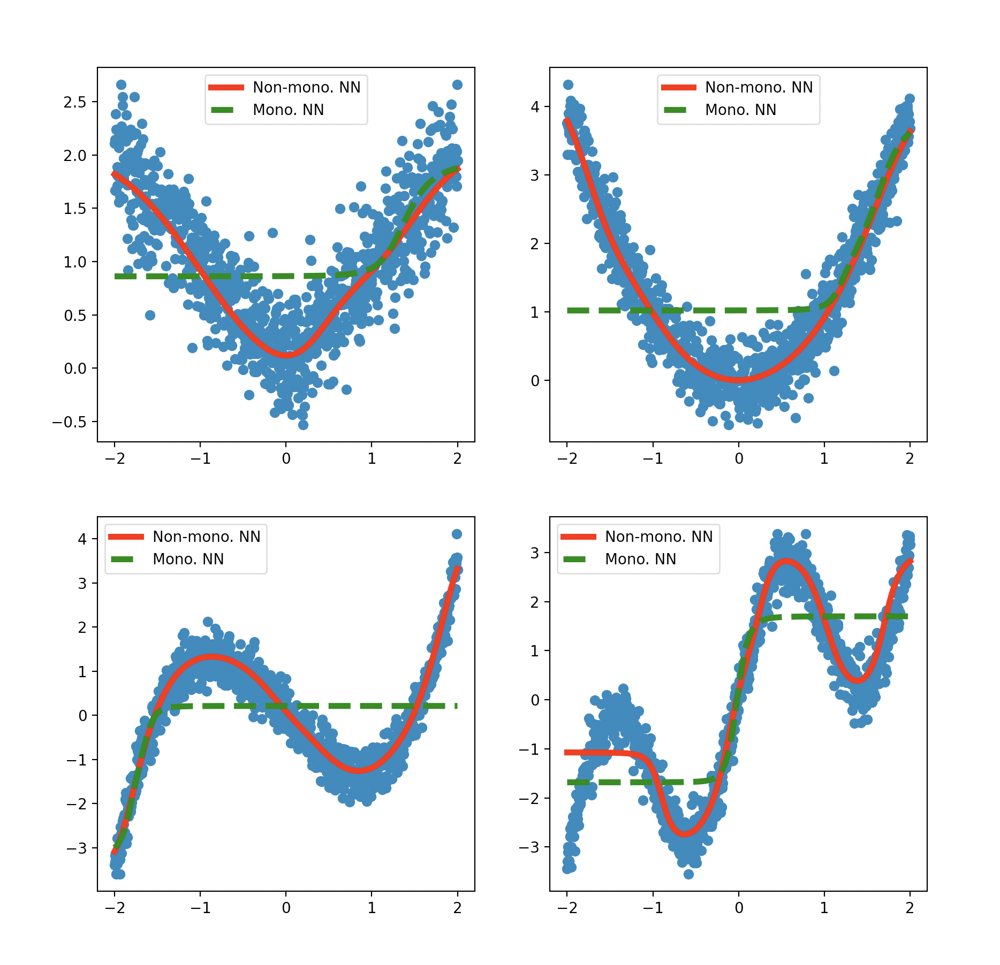
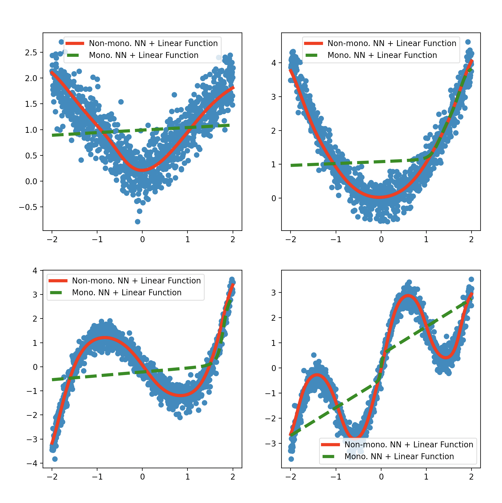

# MonotonicFairness
Supporting code for "Avoiding Resentment Via Monotonic Fairness." 

We have modified this from the following repository: https://github.com/throwaway20190523/MonotonicFairness. We only use this to recreate simulations and add baselines to our model.

# UPDATED for simulated data

# F\_linear + F\_Monotonic

